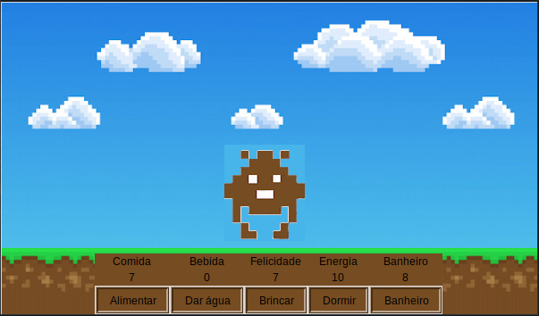

# Pymagochi - um tamagochi, em Python

## O que é este projeto?
Este projeto se trata de uma interface gráfica criada em python com a biblioteca **tkinter** que simula o comportamento de um Tamagochi, onde você precisa cuidar do Pymagochi, alimentando-o, dando água para ele, fazendo com que ele durma, etc.  

## Como utilizar esse projeto?
Para brincar com o Pymagochi, basta fazer o donwload do repositório...

Para rodar o programa, basta rodar o comando `python3 main.py`, que abrirá a interface gráfica que mostra o Pymagochi, seus status e botões para que você interaja com os status aumentando-os quando eles estiverem muito baixos.

Caso o status de banheiro chegue a 0, uma mensagem é mostrada na tela pedindo que você limpe a caixa de areia do Pymagochi, e se algum dos outros estados chegar a 0, o Pymagochi morre, e você deve reinciar o jogo.

## Módulos utilizados
Foi criado um pacote chamado **manipulador_interface** para centralizar algumas das funções utilizadas na implementação, e além disos o projeto do Pymagochi conta com as seguintes importações:
- tkinter 
- tkinter.messagebox
- random.randint
- threading
- os

## Como este projeto funciona?
O Pymagochi trabalha com múltiplas threads, sendo uma delas responsável por atualizar a interface e outra responsável por fazer o decremento dos status do Pymagochi. Quando a tela é fechada ou algum dos estados significativos do objeto Pymagochi instanciado atinge 0, o jogo é encerrado.

## Links úteis

https://pythonguides.com/python-tkinter-label/
https://www.geeksforgeeks.org/how-to-use-images-as-backgrounds-in-tkinter/

dependencias: pygame, tkinter